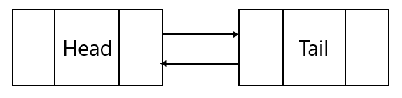

## 리스트의 구조

구현할 리스트는 Double Linked List(이중 연결 리스트)의 형태를 가진다. 구현 과정에서 C++의 클래스와 템플릿을 사용할 것이며, 동적 할당된 메모리를 모두 반납할 수 있는 능력을 키우기 위해 스마트 포인터는 사용하지 않을 것이다.

- 클래스의 용도
생성자를 통해 리스트에 정의된 "head, tail" 포인터에 더미 노드를 할당하고, 소멸자를 통해 객체가 동적으로 할당받은 메모리를 모두 해제할 수 있도록 할 것이다.

- 템플릿의 용도
템플릿은 단순하게 노드에 저장할 데이터 타입을 일반화하는 용도로만 사용할 것이다.

초기 상태는 다음 그림과 같이 head와 tail 포인터가 연결된 상태이다. 



head와 tail 포인터는 각각 더미 노드를 생성해서 가리키도록 할 것이다. 또한 데이터의 삽입은 tail에서 이루어지도록 설계했다.

+) 구현된 코드에서 bool 함수의 반환 값을 이용한 오류 메시지의 출력 기능은 없음.

---

## ADT 정의

1. bool isEmpty();
    - 리스트에 저장된 데이터가 있는지 없는지 판단한다.
    - 데이터가 없으면 true, 존재하면 false를 반환한다.

2. void insertNode(T data);
    - 만들어진 노드에 데이터를 저장한다.
    - 노드를 리스트의 끝(tail)에 추가한다.

3. bool deleteNode(T data);
    - 특정 데이터를 삭제한다. 중복되는 데이터도 삭제한다.
    - 삭제에 성공하면 true, 실패하면 false를 반환한다.

4. bool deleteList();
    - 리스트에 저장된 모든 데이터를 삭제한다.
    - 데이터 삭제 후 listInit() 함수로 리스트를 초기 상태로 만든다.
    - 성공하면 true, 실패하면 false를 반환한다.

\- 추가적인 함수

1. void listInit();
    - 리스트가 비어있는 상황에서 head와 tail 포인터를 서로 연결시켜 리스트를 초기 상태로 만든다.

2. Node* createNode();
    - 새로운 노드를 생성하여 반환한다.

---

## 기능 구현

### 0. Double Linked List 클래스 정의

클래스의 기본적인 형태는 다음과 같다.

```cpp 
template<typename T>
class List {
public:
    // 생성자와 소멸자
	List() {}
	~List() {}

    // List의 ADT
	bool isEmpty() {} 
	void insertNode(T data) {}
	bool deleteNode(T data) {}
	bool deleteList() {}
	void printList() {} // 결과 확인용 함수

private:
    // Node 구조체
	typedef struct _node {} Node;

	Node* head; 
	Node* tail; 
	Node* cur; // 노드를 가리키기 위해 만든 포인터(삭제, 출력 등에 활용)
	int numOfData; // 리스트에 저장된 데이터의 수

    // 외부에서 호출했을 때 문제가 생길 수 있는 함수
    void listInit() {}
    Node* createNode() {}
};
```

생성자는 클래스 멤버 변수의 초기 값을 설정하도록 정의한다.

```cpp
List() {
	// head와 tail에 더미 노드를 생성
	head = new Node;
	tail = new Node;
	cur = nullptr; // 현재 가리키는 대상이 없으므로 nullptr
	listInit(); // 리스트를 초기 상태로 만든다.
}
```

소멸자는 모든 함수의 정의가 끝난 후에 구현하겠다.

---

### 1. Node 구조체 정의

Node 구조체는 리스트에 저장되는 데이터 단위이다. Node 구조체에는 다음과 같은 요소들이 정의되어야 한다.

1. 데이터를 받을 공간
2. 다음 노드를 가리키는 포인터
3. 이전 노드를 가리키는 포인터

이것을 코드로 표현하면 다음과 같다.

```cpp
typedef struct _node {
    T data{}; // 데이터 저장
    struct _node* next{ nullptr }; // 다음 노드
    struct _node* prev{ nullptr }; // 이전 노드
} Node;
```

---

### 2. listInit() 구현

listInit 함수는 head와 tail 포인터를 서로 연결 시킨다. head->next가 tail을, tail->prev가 head를 가리키면 된다. 또한 데이터가 없기 때문에 numOfData의 값을 0으로 만들어 준다.

```cpp
void listInit() {
	// head와 tail 포인터를 연결
	head->next = tail;
	tail->prev = head;
	numOfData = 0; // 데이터의 수 = 0
}
```

---

### 3. isEmpty() 구현

isEmpty 함수는 리스트에 데이터가 존재하는지 확인한다. 필자는 head가 tail 포인터를 가리키고 있으면 리스트가 비어있는 것이라고 정의하고 함수를 구현했다.

```cpp
bool isEmpty() {
	if (head->next == tail) {
		return true;
	}

	return false;
} 
```

---

### 4. createNode() 구현

createNode 함수는 먼저 Node 타입 구조체 공간을 동적 할당 받는다. 이후 초기 값을 설정한 후에 Node의 주소를 반환하는 함수이다. 단순한 기능을 가지는 함수이지만, insertNode 함수가 가지는 삽입이라는 기능과는 구분이 필요하다고 생각이 되어 분리하였다.

```cpp
Node* createNode() {
    // Node 생성 후 반환
	Node* node = new Node;
	return node;
}
```

---

### 5. insertNode(T data) 구현

insertNode 함수는 인자로 받은 데이터를 Node에 저장하고, 그 node를 리스트에 삽입한다.

삽입할 때 두 가지 경우를 고려할 수 있다.
1. 리스트가 비어있는 경우
2. 리스트에 데이터가 존재하는 경우

\- 비어있는 경우에는 다음 과정을 통해 node를 삽입한다.

```cpp
// 리스트가 비어있다면
node->prev = head;
node->next = tail;
head->next = node;
tail->prev = node;
```

\- 데이터가 존재하는 경우에는 다음 과정을 통해 node를 삽입한다.

```cpp
// 데이터가 존재한다면
node->prev = tail->prev;
node->next = tail;
tail->prev->next = node;
tail->prev = node;
```

노드에 데이터를 저장하는 과정까지 합쳐 하나의 코드로 완성하면 다음과 같다.
```cpp
void insertNode(T data) {
	// Node를 생성하고 데이터를 저장한다.
	Node* node{ createNode() };
	node->data = data;

	// 리스트가 비어있다면
	if (isEmpty()) {
		node->prev = head;
		head->next = node;
	}
	// 데이터가 존재한다면
	else {
		node->prev = tail->prev;
		tail->prev->next = node;
	}
	node->next = tail;
	tail->prev = node;
}
```

### 6. deleteNode(T data) 구현

deleteNode 함수는 인자로 들어온 데이터와 동일한 데이터를 저장한 Node를 전부 삭제하는 함수이다. 

먼저 모든 노드를 순회하는 반복문이 필요하다. 각 노드에 방문하여 인자로 전달된 데이터와 동일한 값이 저장되어 있는지 확인해야 하기 때문이다. 만약 값이 동일하다면 그 경우에만 조건문을 걸어 노드를 삭제하는 과정을 거치면 된다.

결과적으로 데이터 삭제에 성공하면 true, 실패하면 false를 반환한다.

+) 삭제할 데이터가 리스트에 존재하지 않더라도 리스트 순회가 끝나고 true를 반환한다.

```cpp
bool deleteNode(T data) {
	// 리스트가 비어있으면 삭제할 데이터도 없다.
	if (isEmpty()) {
		return false;
	}

	cur = head->next; // 리스트 순회 시작 지점
	Node* deleteNode = nullptr; // 동적 할당 해제 시 사용하는 포인터

	// cur이 tail(리스트의 끝)이 아닐 동안 반복
	while (cur != tail) {
        // 앞으로 한 칸 옮긴다.
		deleteNode = cur;
		cur = cur->next;

		// deleteNode가 가리키는 Node의 데이터가 인자에 들어온
		// 데이터와 동일하다면, 해당 Node를 삭제한다.
		if (deleteNode->data == data) {
			// 삭제되는 노드의 앞뒤에 위치한 노드를 서로 연결한 다음에 삭제한다.
			deleteNode->next->prev = deleteNode->prev;
			deleteNode->prev->next = deleteNode->next;
			delete deleteNode;
		}
	}

	return true;
}
```

---

### 7. deleteList() 구현

deleteList 함수는 리스트에 저장된 모든 Node를 삭제하고 초기 상태로 만든다. 모든 노드를 삭제해야 하기 때문에 코드의 형태는 deleteNode 함수와 유사하다.

deleteNode 함수 역시 리스트 초기화에 성공하면 true, 실패하면 false를 반환한다.

```cpp
bool deleteList() {
	if (isEmpty()) {
		return false;
	}

	cur = head->next;
	Node* deleteNode = nullptr;

	// 리스트에 저장된 모든 Node 삭제
	while (cur != tail) {
		deleteNode = cur;
		cur = cur->next;
		delete deleteNode;
	}

	// 리스트를 초기 상태로 만든다.
	listInit();

	return true;
}
```
---

### 8. printList() 구현

printList 함수는 단순하게 리스트가 정상적으로 동작하는지 확인하기 위한 테스트 코드 용도에 가깝다. 필자는 리스트에 저장된 모든 데이터를 출력하도록 구현했다. 출력 순서는 head에서 시작하여 tail의 방향이다.

```cpp
void printList() {
	cur = head->next;

	for (int i = 1; i <= numOfData; ++i) {
		std::cout << "[" << i << "]번째 데이터: " << cur->data << '\n';
		cur = cur->next;
	}
	std::cout << '\n';
}
```

### 9. 소멸자 구현

리스트 객체가 소멸할 때, 리스트가 가지고 있던 동적 할당된 메모리를 모두 반환하고 소멸되어야 한다. 만약 그냥 소멸된다면 메모리 누수(Memory Leak)이 발생하기 때문에 꼭 필요한 작업이다.

isEmpty 함수를 호출하여 데이터가 있다면 deleteList 함수를 호출하여 모든 메모리를 반환한다. 이후 head와 tail에 할당된 메모리까지 반환하면 된다.

```cpp
~List() {
	if (!isEmpty()) {
		deleteList();
	}

	delete head;
	delete tail;

	std::cout << "Executed list destructor!\n";
}
```


