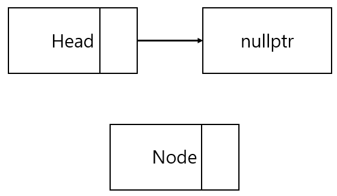
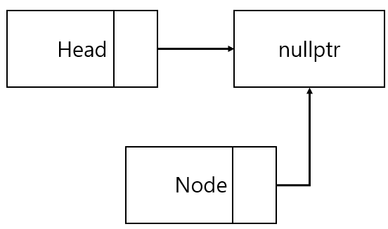
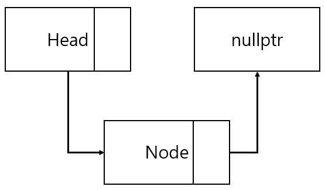
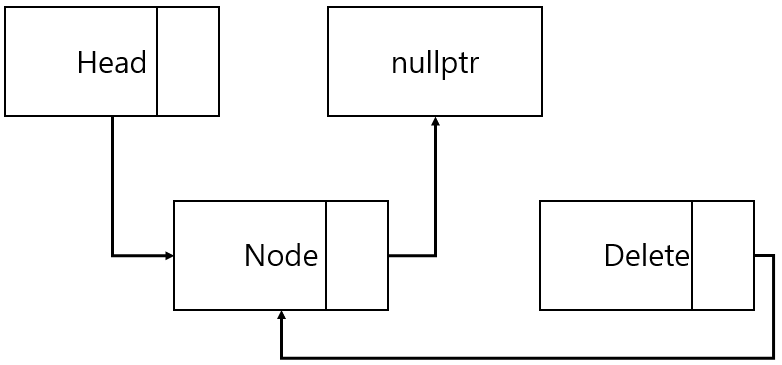
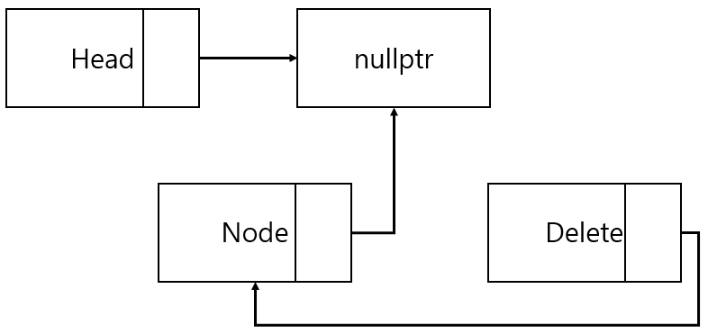
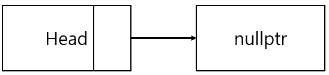

## 서론

- [예제 코드 바로가기](./src/Stack.h)

- [이론 설명 바로가기]()

이 글은 필자가 직접 구현한 스택의 구조를 설명하는 글이다. 개인의 학습 목적으로 작성되었기 때문에 문장과 구현 과정에서 어색하거나 오류가 있을 수 있다.

---

## 스택의 구조

필자는 연결 리스트의 구조를 기반으로 스택을 구현할 것이다.

스택의 top을 가리키는 더미 노드로 head를 생성하고, head에서 삽입과 삭제가 이루어지도록 만들 것이다.

초기 상태(스택이 비어있는 상태)는 head가 nullptr을 가리키는 상태이다. 그 외의 요소들(클래스, 템플릿 등)은 리스트 구현 때와 동일하기 때문에 설명을 생략한다.

---

## ADT 정의

\- ADT

1. bool isEmpty();
    - 스택에 저장된 데이터가 있는지 없는지 판단한다.
    - 데이터가 없으면 true, 존재하면 false를 반환한다.

2. void push(T data);
    - 만들어진 노드에 데이터를 저장한다.
    - 노드를 스택의 top(head)에 추가한다.

3. T pop();
    - 스택의 top을 삭제하고, 그 값을 반환한다.
    - 스택에 데이터가 없을 경우에는 T{}를 반환한다.

4. T peek();
    - 스택의 top을 반환한다.
    - 스택에 데이터가 없을 경우에는 T{}를 반환한다.

5. bool deleteStack();
    - 스택에 저장된 모든 데이터를 삭제한다.
    - 데이터 삭제 후 stackInit 함수로 스택을 초기 상태로 만든다.
    - 성공하면 true, 실패하면 false를 반환한다.

\- 추가적인 함수

1. void stackInit();
    - 스택이 비어있는 상황에서 head 포인터가 nullptr을 가리키도록 만든다.

2. Node* createNode();
    - 새로운 노드를 생성하여 반환한다.

---

## 기능 구현

### 0. Stack 클래스 정의

클래스의 기본적인 형태는 다음과 같다.

```cpp
template<typename T>
class Stack {
public:
	// 생성자와 소멸자
	Stack() {}
	~Stack() {}

	// Stack의 ADT
	bool isEmpty() {}
	void push(T data) {}
	T pop() {}
	T peek() {}
	bool deleteStack() {}
	void printStack() {} // 결과 확인용 함수

private:
	// Node 구조체
	typedef struct _node {} Node;

	Node* head; // 스택의 top을 가리키는 더미 노드
    int numOfData; // 스택에 저장된 데이터의 수

	void stackInit() {}
	Node* createNewNode() {}
};
```

생성자는 클래스 멤버 변수의 초기 값을 설정하도록 정의한다.
```cpp
Stack() {
    // head에 더미 노드를 생성
	head = new Node;
	stackInit(); // 스택을 초기 상태로 만든다.
}
```

소멸자는 모든 함수의 정의가 끝나고 구현한다.

---

### 1. Node 구조체 정의

Node 구조체는 스택에 저장되는 데이터 단위이다. 스택의 Node 구조체에는 다음과 같은 요소들이 정의되어야 한다.

1. 데이터를 받을 공간
2. 다음 노드를 가리키는 포인터

이것을 코드로 표현하면 다음과 같다.

```cpp
typedef struct _node {
	T data; // 데이터 저장
	struct _node* next; // 다음 노드
} Node;
```

---

### 2. stackInit() 구현

stackInit 함수는 head가 nullptr을 가리키도록 초기 상태를 만든다. 또한 데이터가 없기 때문에 numOfData의 값을 0으로 초기화 한다.

```cpp
void stackInit() {
	// head가 nullptr을 가리키도록 한다.
	head->next = nullptr;
	numOfData = 0; // 저장된 데이터의 수 = 0
}
```

---

### 3. isEmpty() 구현

isEmpty 함수는 스택에 데이터가 존재하는지 확인한다. 필자는 head가 nullptr을 가리키고 있으면 스택이 비어있는 것이라고 정의하고 함수를 구현했다.

```cpp
bool isEmpty() {
	return head->next == nullptr;
}
```

---

### 4. createNode() 구현

createNode 함수의 구조는 리스트 구현 때와 동일하기 때문에 설명은 생략하고 코드만 보인다.

```cpp
Node* createNode() {
    // Node 생성 후 반환
	Node* node = new Node;
	return node;
}
```

---

### 5. push() 구현

push 함수는 스택에 데이터를 삽입한다. 스택은 리스트와 다르게, 삽입 연산을 할 때 스택이 비어있는지 확인할 필요가 없다. 삽입 연산의 과정이 다음과 같기 때문이다.

1. Node를 생성하고 데이터를 저장한다.



2. 생성된 Node가 가리키는 노드는 현재 head가 가리키는 Node로 한다.



3. head가 생성된 Node를 가리키도록 한다.



만약 head가 nullptr이 아니라 다른 데이터를 가리키고 있어도 똑같은 과정을 통해 데이터를 삽입할 수 있다. 위의 과정을 코드로 표현하면 다음과 같다.

```cpp
void push(T data) {
	// 노드를 생성하고 데이터를 저장한다.
	Node* node{ createNode() };
	node->data = data;

	// 스택의 top에 데이터를 삽입한다.
	node->next = head->next;
	head->next = node;

    ++numOfData; // 노드가 삽입되었기 때문에 데이터의 수를 +1
}
```

---

### 6. pop() 구현

pop 함수는 스택의 top을 삭제하고, 그 데이터를 반환한다.

스택에서 데이터를 삭제하는 과정은 다음과 같다.

1. 삭제할 노드를 가리키는 포인터를 만들고, 저장된 데이터를 다른 공간에 복사한다.



2. head가 삭제할 노드의 다음 노드를 가리키도록 한다.



3. 노드를 삭제한다.



4. 복사한 데이터를 반환한다.

여기서 추가로 생각해야 할 점은 스택이 비어있을 때에는 pop 연산이 불가능하다는 것이다. 현재 시점에서는 스택이 비어있다면 pop 연산 이전에 T{};를 반환하는 것으로 해결했다.

```cpp
T pop() {
	// 스택이 비어있다면 더미 데이터 반환
	// 추후에 바뀔 수 있음
	if (isEmpty()) {
		return T{};
	}

	// pop 연산 과정
	Node* deleteNode{ head->next };
	T data{ deleteNode->data };
	head->next = deleteNode->next;
	delete deleteNode;
	--numOfData; // 노드가 삭제되었기 때문에 데이터의 수를 -1

	return data; // 삭제된 데이터 반환
}
```

---

### 7. peek() 구현

peek 함수는 스택의 top을 반환하는 함수이다. 단순하게 top에 저장된 데이터를 반환하기 때문에 구현도 매우 간단하다. 물론 pop 함수와 동일하게 스택이 비어있다면 T{};를 반환해야 한다.

```cpp
T peek() {
	// 스택이 비어있다면 더미 데이터 반환
	if (isEmpty()) {
		return T{};
	}

	// top에 저장된 데이터 반환
	return head->next->data;
}
```

### 8. deleteStack() 구현

deleteStack 함수는 스택에 저장된 모든 Node를 삭제하고 초기 상태로 만든다. 구현 형태는 리스트의 deleteList와 유사하다

```cpp
bool deleteStack() {
	// 스택이 비어있다면 
	if (isEmpty()) {
		return false;
	}

	// 스택에 저장된 모든 Node 삭제
	Node* deleteNode{ nullptr };
	while (head->next != nullptr) {
		deleteNode = head->next;
		head->next = deleteNode->next;
		delete deleteNode;
	}

	// 스택을 초기 상태로 만든다.
	stackInit();

	return true;
}
```

### 9. printList() 구현

리스트에서와 동일하게 printList 함수는 그저 결과 확인용 코드이다. 스택의 top에서부터 시작하여 모든 데이터를 순차적으로 출력한다. 필자는 다음과 같이 구현했다.

```cpp
void printStack() {
	if (isEmpty()) {
		return;
	}

	Node* cur{ head->next };
	for (int i = 1; i <= numOfData; ++i) {
		std::cout << "[" << i << "]번째 데이터: " << cur->data << '\n';
		cur = cur->next;
	}
	std::cout << '\n';
}
```

---

### 10. 소멸자 구현

리스트에서와 동일하게 deleteStack 함수를 먼저 호출하여 동적 할당 받은 모든 데이터를 반환한 후, head에 할당된 더미 노드까지 반환하면 된다.

```cpp
~Stack() {
	deleteStack();
	delete head;

	std::cout << "Executed stack destructor!\n";
}
```

---

## 결론

=> 