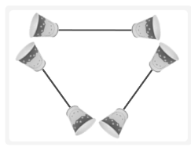
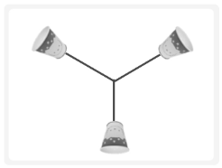

# CH 12. IO 멀티플렉싱(Multiplexing)

## 12-1 IO 멀티플렉싱 기반의 서버

- 멀티프로세스 서버의 단점과 대안

이전 CH에서는 다중접속 서버의 구현을 위해서 클라이언트의 연결요청이 있을 때마다 새로운 프로세스를 생성하였다. 그러나 문제점도 있다. `프로세스의 생성`에는 `많은 양의 연산`과 `메모리 공간` 등 상당히 많은 대가를 지불해야 하기 때문이다. 또한 프로세스마다 별도의 메모리 공간을 유지하기 떄문에 상호간에 데이터를 주고받으려면 다소 복잡한 방법을 택할 수밖에 없다.(IPC는 다소 복잡한 통신방법이다.)<br>
`IO 멀티플렉싱 서버`를 사용하면 `프로세스의 생성 없이` 다수의 클라이언트에게 서비스를 제공할 수 있다. 물론 서버의 특성에 따라서 적절한 구현방법을 결정해야 한다.

---

- 멀티플렉싱(Multiplexing)

멀티플렉싱은 다음과 같이 설명할 수 있다.
> `하나의 통신채널`을 통해서 `둘 이상의 데이터(시그널)를 전송`하는 데 사용되는 기술

조금 더 풀어서 설명하면 다음과 같다.
> 물리적 장치의 효율성을 높이기 위해서 `최소한의 물리적인 요소만 사용`해서 `최대한의 데이터를 전달`하기 위해 사용되는 기술

이를 위해 컵 전화기를 예시로 들어보겠다.<br>
<br>
위 그림은 3인이 동시에 통화할 수 있는 시스템이다. 이 시스템을 이용해서 3인이 동시에 대화하기 위해서는 말할 때도 두 개의 컵을 입에 가까이 대야하고, 들을 때도 두 개의 컵을 동시에 가져다 대야 한다. 그럼 이 시스템에 멀티플렉싱 기술을 도입해보자.<br>
<br>
위 그림과 같이 멀티플렉싱을 도입하면 다음과 같은 장점을 얻게 된다.
1. 필요한 실의 길이가 줄었다.
2. 필요한 컵의 개수가 줄었다.

위의 시스템에는 `시(Time)분할 멀티플렉싱 기술`이 적용되었다고 말할 수 있다. 또한 대화하는 대상의 목소리 톤이(주파수가) 다르기 때문에 동시에 말을 하는 상황에서도 어느 정도 목소리를 구분할 수 있다. 때문에 `주파수(Frequency) 분할 멀티플렉싱 기술`도 적용되었다고 말할 수 있다.

---

- 멀티플렉싱의 개념을 서버에 적용하기

이번에는 서버에 멀티플렉싱 기술을 도입해서 필요한 프로세스의 수를 줄여보자. CH 10에서 멀티프로세스 기반의 서버를 구성했을 때에는 클라이언트의 수만큼 자식 프로세스를 계속 복사했다.<br>
`멀티플렉싱 기술`을 적용하면 `하나의 프로세스로도 여러 클라이언트에게 서비스를 제공`할 수 있다.

## 12-2 select 함수의 이해와 서버의 구현

`select` 함수를 이용하는 것이 멀티플렉싱 서버의 구현에 있어서 가장 대표적인 방법이다. 그리고 윈도우에서도 이와 동일한 이름으로 동일한 기능을 제공하는 함수가 있기 때문에 `이식성에서도 좋다.`

---

- select 함수의 기능과 호출순서
select 함수를 사용하면 `한 곳에 여러 개의 파일 디스크립터를 모아놓고 동시에 이들을 관찰`할 수 있다. 관찰할 수 있는 항목은 다음과 같다.
1. 수신한 데이터를 지니고 있는 소켓이 존재하는가?
2. 블로킹되지 않고 데이터의 전송이 가능한 소켓은 무엇인가?
3. 예외상황이 발생한 소켓은 무엇인가?

추가적으로 이러한 항목을 이벤트라고 하고, 관찰항목에 속하는 상황이 발생했을 때, `이벤트(Event)가 발생했다`라고 표현한다.

select 함수는 사용방법에 있어서 일반적인 함수들과 많은 차이를 보인다. 호출방법과 순서는 다음과 같다.
1. 파일 디스크립터의 설정 -> 검사의 범위 지정 -> 타임아웃의 설정
2. select 함수의 호출
3. 호출결과 확인

---

- 파일 디스크립터의 설정

먼저 관찰하고자 하는 파일 디스크립터를 모아야 한다. 모을 때도 관찰항목(수신, 전송, 예외)에 따라서 구분해서 모아야 한다. 파일 디스크립터를 세 묶음으로 모을 때 사용되는 것이 `fd_set`형 변수이다. 이 변수는 `0과 1로 표현`되는, `비트단위로 이뤄진 배열의 형태`를 가진다. `1로 설정되면 해당 파일 디스크립터가 관찰의 대상`임을 의미한다.<br>
fd_set형 변수에 값을 등록하거나 변경하는 등의 작업은 매크로 함수들의 도움을 통해서 이뤄진다.
| 매크로 함수 | 기능 |
| :---: | --- |
| `FD_ZERO(fd_set* fdset)` | 인자로 전달된 주소의 fd_set형 변수의 모든 비트를 0으로 초기화한다. |
| `FD_SET(int fd, fd_set* fdset)` | 매개변수 fdset으로 전달된 주소의 변수에 매개변수 fd로 전달된 파일 디스크립터 정보를 등록한다. |
| `FD_CLR(int fd, fd_set* fdset)` | 매개변수 fdset으로 전달된 주소의 변수에서 매개변수 fd로 전달된 파일 디스크립터 정보를 삭제한다. |
| `FD_ISSET(int fd, fd_set* fdset)` | 매개변수 fdset으로 전달된 주소의 변수에 매개변수 fd로 전달된 파일 디스크립터 정보가 있으면 양수를 반환한다. |

이 중에서 `FD_ISSET`은 `select 함수의 호출결과를 확인`하는 용도로 사용한다.

---

- 검사(관찰)의 범위지정과 타임아웃의 설정

먼저 select 함수에 대해 설명하겠다.
```cpp
#include <sys/select.h>
#include <sys/time.h>

int select(int maxfd, fd_set* readset, fd_set* writeset, fd_set* exceptset, const struct timeval* timeout);
// 성공 시 0 이상, 실패 시 -1 반환
```
2, 3, 4번째 인자로 세 가지 관찰 항목에 대해 설정할 수 있다. 이에 앞서 다음 두 가지를 먼저 결정해야 한다.
1. 파일 디스크립터의 관찰(검사) 범위
2. select 함수의 타임아웃 시간

1번은 select 함수의 첫 번째 매개변수와 관련이 있다. 이곳에는 `fd_set형 변수에 등록된 파일 디스크립터의 수를 전달`해야 한다. 따라서 가장 큰 파일 디스크립터의 값에 1을 더해서 전달하면 된다. 1을 더하는 이유는 파일 디스크립터의 값이 0부터 시작하기 때문이다.<br>
2번은 select 함수의 마지막 매개변수와 관련이 있다. timeval 구조체 자료형은 다음과 같이 정의되어 있다.
```cpp
struct timeval {
    long tv_sec; // seconds
    long tv_usec; // microseconds
}
```
원래 select 함수는 `관찰중인 파일 디스크립터에 변화가 생겨야 반환`을 한다. 때문에 `변화가 생기지 않으면 무한정 블로킹 상태`에 머물게 된다. 이러한 상황을 막기 위해서 타임아웃을 지정하는 것이다. 만약 타임아웃을 설정하고 싶지 않을 경우에는 NULL을 인자로 전달하면 된다.

---

- select 함수호출 이후의 결과확인

select 함수가 양의 정수를 반환한 경우, 2, 3, 4번째 인자로 전달된 fd_set형 변수에서 변화를 확인할 수 있다. `1로 설정된 모든 비트가 다 0으로 변경`되지만, `변화가 발생한 파일 디스크립터에 해당하는 비트만 그대로 1로 남아있게 된다.` 때문에 여전히 1로 남아있는 위치의 파일 디스크립터에서 변화가 발생했다고 판단할 수 있다.

