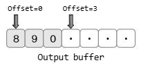

# CH 13. 다양한 입출력 함수들

## 13-1 send & recv 입출력 함수

지금까지 윈도우 기반 예제 작성시에는 send & recv 함수를 사용해 왔다.

---

- 리눅스에서의 send & recv

CH 01에서 send & recv 함수를 소개했지만 윈도우 기반에서 소개했었다. 이번에는 리눅스 기반에서 send & recv 함수를 소개하겠다.
```cpp
#include <sys/socket.h>

ssize_t send(int sockfd, const void* buf, size_t nbytes, int flags);
// 성공 시 전송된 바이트 수, 실패 시 -1 반환
```
위의 send 함수와 CH 01에서 소개한 윈도우의 send ㅎ마수를 비교해보면 선언된 자료형의 이름에서는 차이가 조금 난다. 그러나 매개변수의 순서, 의미 그리고 사용방법까지 완전히 동일하기 때문에 사실상 차이가 없다. 그럼 이어서 recv 함수를 소개하겠다.
```cpp
#include <sys/socket.h>

ssize_t recv(int sockfd, void* buf, size_t nbytes, int flags);
// 성공 시 수신한 바이트 수(단 EOF 전송 시 0), 실패 시 -1 반환
```
send 함수와 recv 함수의 마지막 매개변수에는 데이터 송수신 시 적용할 옵션정보가 전달된다. 옵션 정보는 비트 OR 연산자(`| 연산자`)를 이용해서 둘 이상을 함께 전달할 수 있다.
| 옵션(Option) | 의 미 | send | recv |
| :---: | --- | :---: | :---: |
| `MSG_OOB` | 긴급 데이터(Out-of-band data)의 전송을 위한 옵션 | O | O |
| `MSG_PEEK` | 입력버퍼에 수신된 데이터의 존재유무 확인을 위한 옵션 | | O |
| `MSG_DONTROUTE` | 데이터 전송과정에서 라우팅(Routing) 테이블을 참조하지 않을 것을 요구하는 옵션, 따라서 로컬(Local) 네트워크상에서 목적지를 찾을 때 사용되는 옵션 | O | |
| `MSG_DONTWAIT` | 입출력 함수 호출과정에서 블로킹 되지 않을 것을 요구하기 위한 옵션. 즉, 넌-블로킹(Non-blocking) IO의 요구에 사용되는 옵션 | O | O |
| `MSG_WAITALL` | 요청한 바이트 수에 해당하는 데이터가 전부 수신될 때까지, 호출된 함수가 반환되는 것을 막기 위한 옵션 | | O |

참고로 위에서 정리한 옵션의 지원여부는 운영체제마다 조금씩 차이가 날 수 있다. 이제 위의 표에서 언급한 옵션 중에서 운영체제에 따라서 차이를 보이지 않는 옵션들 위주로 보다 자세히 살펴보자.

---

- MSG_OOB: 긴급 메시지의 전송

옵션 MSG_OOB는 `Out-of-band data`라 불리는 긴급 메시지의 전송에 사용된다. 긴급으로 무엇인가를 처리하려면, 처리방법 및 경로가 달라야 한다. 이렇듯 옵션 MSG_OOB는 긴급으로 전송해야 할 메시지가 있어서 메시지의 전송방법 및 경로를 달리하고자 할 때 사용된다.<br>
코드상에서 전송에 대한 부분은 send 함수호출 시 옵션정보로 MSG_OOB를 전달하기만 하면 된다. 그러나 긴급 메시지 수신에서는 복잡한 과정을 거친다. 예제 코드 중에서 생소한 개념이 많이 나오는데 이건 나중에 CH 17에서 설명한다. 일부만 설명하면 다음과 같다.

```cpp
fcntl(recv_sock, F_SETOWN, getpid());
```
fcntl 함수는 파일 디스크립터의 컨트롤에 사용이 된다. 여기서 보인 위 문장은 다음의 의미를 담고 있다.
> 파일 디스크립터 recv_sock이 가리키는 소켓의 소유자(F_SETOWN)를 getpid 함수가 반환하는 ID의 프로세스로 변경시키겠다.

소켓의 소유자라는 개념이 생소할 수 있다. 기본적으로 소켓은 운영체제가 생성 및 관리를 하기 때문에 소켓의 소유자는 운영체제라고 볼 수 있다. 다만 여기서 말하는 소유자는 이 소켓에서 발생하는 모든 일의 책임 주체를 의미하는 것이다. 풀어서 설명하면 다음과 같다.
> 파일 디스크립터 recv_sock이 가리키는 소켓에 의해 발생하는 SIGURG 시그널을 처리하는 프로세스를 getpid 함수가 반환하는 ID의 프로세스로 변경시키겠다.

SIGURG 시그널 처리는 `SIGURG 시그널의 핸들러 함수호출`을 의미한다. 하나의 소켓에 대한 파일 디스크립터를 여러 프로세스가 함게 소유할 수 있다. 이러한 상황에서 SIGURG 시그널 발생 시 어느 프로세스의 핸들러 함수를 호출해야 하는지 명확하지 않다. 따라서 SIGURG 시그널을 핸들링 할 때에는 반드시 시그널을 처리할 프로세스를 지정해 줘야 한다. 그리고 getpid는 이 함수를 호출한 프로세스의 ID를 반환하는 함수이다. 결과적으로 위의 문장은 `현재 실행 중인 프로세스를 SIGURG 시그널의 처리 주체로 지정`하는 것이다.

예제의 결과를 보면 MSG_OOB 옵션을 추가해서 데이터를 전달할 경우, 1바이트만 반환이 되고, 특별히 빨리 전송되지도 않는다. TCP에는 진정한 의미의 'Out-of-band data'가 존재하지 않기 때문이다. 'Out-of-band data'는 다음의 의미를 지닌다.
> 전혀 다른 통신 경로로 전송되는 데이터

하지만 TCP에서는 별도의 통신 경로를 제공하지 않고 있다. 다만 TCP에 존재하는 `Urgent mode`라는 것을 이용해서 데이터를 전송해준다.

---

- Urgent mode의 동작 원리

MSG_OOB의 옵션은 다음과 같은 효과를 가져다 준다.
> 긴급으로 처리해야 할 데이터가 들어갔으니 빨리 처리해라.

즉, 데이터를 수신하는 대상에게 처리를 독촉하는 역할이다. 이후 데이터의 전송에는 `전송순서가 그대로 유지된다.`라는 TCP의 전송특성이 유지된다. 그럼 왜 긴급 메시지일까?<br>
응급 환자를 생각해보자. 병원으로 빠른 이동이 이뤄지지 않았다고 해서 빠른 조치까지 필요치 않은 것은 아니다. TCP의 긴급 메시지는 빠른 이동은 보장하지 않는다. 대신 빠른 조치를 요구한다. 물론 빠른 응급조치는 프로그램을 구현하는 사람의 몫이긴 하다.

<br>
위 그림은 예제에서의 출력버퍼 상황이다. 가장 왼쪽위치를 오프셋 0으로 보면, 문자 0은 오프셋 2의 위치에 저장되어 있는 상황이다. 그리고 문자 0의 오른편인 오프셋 3의 위치가 `Urgent Pointer`로 지정되었다고 말할 수 있다. Urgent Pointer는 긴급 메시지의 다음 번(오프셋이 1 증가한) 위치를 가리키면서 다음의 정보를 상대 호스트에게 전달하는 의미를 갖는다.
> Urgnet Pointer가 가리키는 오프셋 3의 바로 앞에 존재하는 것이 긴급 메시지다!

즉, 긴급 메시지 저옵는 실제로 하나의 바이트에만 표시가 된다. TCP 패킷의 구조를 보면 보다 명확히 알 수 있다.

<br>
TCP 패킷의 내용 중 URG 설정 부분만 가져왔다. TCP 헤더 부분을 보면 다음 두 가지 정보가 포함되어 있다.
1. URG = 1: 긴급 메시지가 존재하는 패킷이다.
2. URG Pointer: Urgent Pointer의 위치가 오프셋 3의 위치에 있다.

즉, MSG_OOB 옵션이 지정되면 패킷 자체가 긴급 패킷이 되며, Urgent Pointer를 통해서 긴급 메시지의 위치도 표시가 된다.

---

- 입력버퍼 검사하기

MSG_PEEK 옵션은 MSG_DONTWAIT 옵션과 함께 설정되어 입력버퍼에 수신된 데이터가 존재하는지 확인하는 용도로 사용된다. MSG_PEEK 옵션을 주고 recv 함수를 호출하면 입력버퍼에 존재하는 데이터가 읽혀지더라도 입력버퍼에서 데이터가 지워지지 않는다. 때문에 MSG_DONTWAIT 옵션과 묶여서 블로킹 되지 않는, 데이터의 존재유무를 확인하기 위한 함수의 호출 구성에 사용된다.

