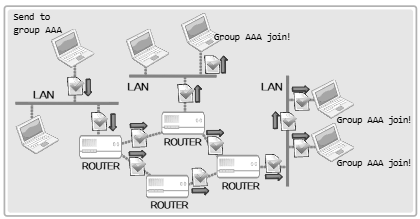

# CH 14. 멀티캐스트 & 브로드캐스트

## 14-1 멀티캐스트(Multicast)

`멀티캐스트` 방식의 데이터 전송은 `UDP를 기반`으로 한다. 따라서 UDP 서버/클라이언트의 구현방식이 매유 유사하다. 차이점이 있다면 멀티캐스트에서의 데이터 전송은 `특정 그룹에 가입(등록)되어 있는 다수의 호스트`가 된다는 점이다.

---

- 멀티캐스트의 데이터 전송방식과 멀티캐스트 트래픽 이점

멀티캐스트의 데이터 전송특성은 다음과 같이 간단히 정리할 수 있다.
1. 멀티캐스트 서버는 특정 멀티캐스트 그룹을 대상으로 데이터를 `딱 한 번 전송`한다.
2. 딱 한 번 전송하더라도 `그룹`에 속하는 `클라이언트는 모두 데이터를 수신`한다.
3. 멀티캐스트 그룹의 수는 IP주소 범위 내에서 얼마든지 추가가 가능하다.
4. 특정 멀티캐스트 그룹으로 전송되는 `데이터를 수신하려면 해당 그룹에 가입`하면 된다.

여기서 말하는 `멀티캐스트 그룹`은 `클래스 D에 속하는 IP주소(224.0.0.0~239.255.255.255)`를 뜻한다. 따라서 멀티캐스트 그룹에 가입을 한다는 것은 프로그램 코드상에서 다음과 같이 이해할 수 있다.
> 나는 클래스 D에 속하는 IP주소 중에서 239.234.218.234를 목적지로 전송되는 멀티캐스트 데이터에 관심이 있으므로, 이 데이터를 수신하겠다.

멀티캐스트는 UDP를 기반으로 한다고 하였다. 여기서는 일반적인 UDP 패킷과 달리 하나의 패킷만 네트워크상에 띄워 놓으면 라우터들은 이 패킷을 복사해서 다수의 호스트에 이를 전달한다.<br>
<br>
그림을 보면 하나의 멀티캐스트 패킷이 라우터들의 도움으로 AAA 그룹에 가입한 모든 호스트에 전송되고 있다. 이 과정이 트래픽 측면에서 부정적이라고 생각할 수 있다. 하지만 `멀티캐스트는 이러한 상황의 해결책`으로 나온 기술이다.<br>
단순하게 생각하면 하나의 패킷이 여러 라우터를 통해 복사되기 때문에 비효율적으로 보인다. 하지만 `하나의 영역에 동일한 패킷이 둘 이상 전송되지 않는다는 부분`도 생각해야 한다. 만약 TCP 또는 UDP 방식으로 1,000개의 호스트에 파일을 전송하려면, 총 1,000회 파일을 전송해야 한다. 열 개의 호스트가 하나의 네트워크로 묶여 있어서 경로의 99%가 일치하더라도 말이다. 하지만 멀티캐스트 방식으로 파일을 전송하면 딱 한 번만 전송해주면 된다. 이러한 성격 때문에 멀티캐스트 방식의 데이터 전송은 `멀티미디어 데이터의 실시간 전송`에 주로 사용된다.<br>
적지 않은 수의 라우터가 멀티캐스트를 지원하지 않거나 지원하더라도 네트워크의 불필요한 트래픽 문제를 고려해서 일부러 막아 놓은 경우가 많다. 때문에 멀티캐스트를 지원하지 않는 라우터를 거쳐서 멀티캐스트 패킷을 전송하기 위한 `터널링(Tunneling) 기술`이라는 것도 사용이 된다.(이 부분은 멀티캐스트 기반의 프로그램 개발자가 고민할 문제는 아니다.)

---

- 라우팅(Routing)과 TTL(Time to Live), 그리고 그룹으로의 가입방법

멀티캐스트 패킷의 전송을 위해서는 TTL이라는 것의 설정과정을 반드시 거쳐야 한다. `TTL`이란 `Time to Live`의 약자로써 `패킷을 얼마나 멀리 전달할 것인가`를 결정하는 주 요소가 된다. TTL은 `정수`로 표현되며, 이 값은 `라우터를 하나 거칠 때마다 1씩 감소`한다. 그리고 이 값이 `0`이 되면 패킷은 더 이상 전달되지 못 하고 `소멸`된다. 따라서 너무 크면 트래픽 측면에서 좋지 않고, 너무 작아도 목적지에 도달하지 않는 문제가 생긴다.<br>
TTL의 설정은 CH 09에서 설명한 소켓의 옵션설정을 통해 이뤄진다. `TTL의 설정`과 관련된 프로토콜의 레벨은 `IPPROTO_IP`이고 옵션의 이름은 `IP_MULTICAST_TTL`이다. 따라서 TTL을 64로 설정하고자 할 때는 다음과 같이 코드를 구성하면 된다.
```cpp
int send_sock;
int time_live = 64;
. . . . 
send_sock = socket(PF_INET, SOCK_DGRAM, 0);
setsockopt(send_sock, IPPROTO_IP, IP_MULTICAST_TTL, (void*)&time_live, sizeof(time_live));
```
`멀티캐스트 그룹으로의 가입` 역시 소켓의 옵션설정을 통해 이뤄진다. 그룹 가입과 관련된 프로토콜의 레벨은 `IPPORTO_IP`이고, 옵션의 이름은 `IP_ADD_MEMBERSHIP`이다. 그룹의 가입은 다음과 같이 진행된다.
```cpp
int recv_sock;
struct ip_merq join_adr;
. . . . 
recv_sock = socket(PF_INET, SOCK_DGRAM, 0);
. . . .
join_adr.imr_multiaddr.s_addr = "멀티캐스트 그룹의 주소정보";
join_adr.imr_interface.s_addr = "그룹에 가입할 호스트의 주소정보";
setsockopt(recv_sock, IPPROTO_IP, IP_ADD_MEMBERSHIP, (void*)&join_adr, sizeof(join_adr));
. . . . 
```
여기서 `구조체 ip_merq`는 다음과 같이 정의되어 있다.
```cpp
struct ip_mreq {
    struct in_addr imr_multiaddr;
    struct in_addr imr_interface;
}
```
첫 번째 멤버 `imr_multiaddr에는 가입할 그룹의 IP주소`, 두 번째 멤버인 `imr_interface에는 그룹에 가입하는 소켓이 속한 호스트의 IP주소`를 명시한다. imr_interface에 명시할 주소에 INADDR_ANY를 이용하는 것도 가능하다.

멀티캐스트 기반에서는 서버, 클라이언트라는 표현을 대신해서 `전송자(Sender)`, `수신자(Receiver)`라는 표현을 사용한다. 여기서 Sender는 말 그대로 멀티캐스트 데이터의 전송주체, Receiver는 멀티캐스트 그룹의 가입과정이 필요한 데이터의 수신주체이다.<br>
보통 Sender가 Receiver보다 구현 과정이 간단하다. Receiver는 그룹의 가입과정이 필요하지만, Sender는 UDP 소켓을 생성하고 멀티캐스트 주소로 데이터를 전송만 하면 되기 때문이다.

## 14-2 브로드캐스트(Broadcast)

멀티캐스트는 서로 다른 네트워크상에 존재하는 호스트라 할지라도, 멀티캐스트 그룹에 가입만 되어 있으면 데이터의 수신이 가능하다. 반면 `브로드캐스트`는 `동일한 네트워크로 연결되어 있는 호스트`로, 데이터의 전송 대상이 제한된다.

--- 

- 브로드캐스트의 이해와 구현방법

브로드캐스트는 동일한 네트워크에 연결되어 있는 모든 호스트에게 동시에 데이터를 전송하기 위한 방법이다. 이 역시 멀티캐스트와 마찬가지로 UDP를 기반으로 데이터를 송수신한다. 그리고 데이터 전송 시 사용되는 IP주소의 형태에 따라서 다음과 같이 두 가지 형태로 구분된다.
1. `Directed Broadcast`
2. `Local Broadcast`

`Directed 브로드캐스트`의 IP주소는 `네트워크 주소를 제외한 나머지 호스트 주소를 전부 1로 설정`해서 얻을 수 있다. 예를 들어서 네트워크 주소가 192.12.34.0/24인 네트워크에 연결되어 있는 모든 호스트에게 데이터를 전송하려면 192.12.34.255로 데이터를 전송하면된다.<br>
반면 `Local 브로드캐스트`를 위해서는 `255.255.255.255`라는 IP주소가 예약되어 있다. 예를 들어 네트워크 주소가 192.32.24.0/24인 네트워크에 연결되어 있는 호스트가 IP주소 255.255.255.255를 대상으로 데이터를 전송하면, 192.32.24.0/24 네트워크에 속하는 모든 호스트에 데이터가 전달된다.<br>
브로드캐스트는 데이터 송수신에 사용되는 IP주소가 UDP 기반 서버/클라이언트 예제와의 유일한 차이점이다. 다만 기본적으로 생성되는 소켓은 브로드캐스트 기반의 데이터 전송이 불가능하도록 설정되어 있기 때문에 다음 유형의 코드 구성을 통해서 이를 변경할 필요는 있다.
```cpp
int send_sock;
int bcast = 1; // SO_BROADCAST의 옵션정보를 1로 변경하기 위한 변수 초기화
. . . . 
send_sock = socket(PF_INET, SOCKL_DGRAM, 0);
. . . . 
setsockopt(send_sock, SOL_SOCKET, SO_BROADCAST, (void*)&bcast, sizeof(bcast));
. . . .
```
위의 setsockopt 함수호출을 통해서 `SO_BROADCAST`의 옵션정보를 변수 bcast에 저장된 값인 `1로 변경`하는데, 이는 `브로드캐스트 기반의 데이터 전송이 가능함을 의미`한다. 해당 과정은 데이터를 전송하는 `Sender에서만 필요`하다.
