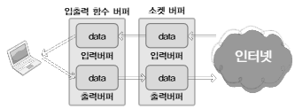

# CH 15. 소켓과 표준 입출력

## 15-1 표준 입출력 함수의 장점

이번 CH에서는 `표준 입출력 함수`를 이용한 `데이터 송수신 방법`에 대해 소개한다. 파일을 다룰 때 사용했던 fopen, feof, fgetc, fputs와 같은 함수들이 익숙하면 문제 없다.

---

- 표준 입출력 함수의 두 가지 장점

표준 입출력 함수는 다음 두 가지 장점을 가진다.
1. 표준 입출력 함수는 `이식성(Portability)`이 좋다.
2. 표준 입출력 함수는 `버퍼링을 통한 성능의 향상`에 도움이 된다.

1번 장점은 많은 설명이 필요 없을 것이다. 모든 표준 함수들은 이식성이 좋기 때문이다. 그래서 2번 장점을 위주로 살펴보자.<br>
표준 입출력 함수를 사용할 경우 `추가적으로 입출력 버퍼를 제공`받게 된다. 그런데 소켓을 생성하면 기본적으로 운영체제에 의해서 입출력 버퍼가 생성된다고 했다. 따라서 입력과 출력 버퍼가 각각 `2개씩 존재`한다는 말이 된다. 그럼 두 버퍼의 관계를 정리해보자.<br>
<br>
위 그림에서 보이듯이 표준 입출력 함수를 사용해서 데이터를 전송할 경우, 거쳐야 하는 버퍼의 수는 2개가 된다. 만약 두 호스트가 표준 입출력 함수로 데이터를 주고 받는 상황이고, 호스트 A가 호스트 B에게 데이터를 전송하면 다음과 같은 과정을 거칠 것이다.
> 호스트 A -> 표준 출력 함수의 버퍼 -> 소켓의 출력 버퍼 -> 소켓의 입력 버퍼 -> 표준 입력 함수의 버퍼 -> 호스트 B

과정만 보면 비효율적으로 생겼다. 그런데 `버퍼`는 기본적으로 `성능의 향상을 목적`으로 한다. 하지만 `소켓`과 관련해서 제공되는 `버퍼는 TCP의 구현을 위한 목적`이 더 강하다. 예를 들어 TCP의 경우 데이터가 분실되면 재전송을 진행하는데, 그 재전송을 위해 소켓 버퍼에 저장된 데이터를 사용한다. 표준 입출력 함수가 제공하는 버퍼는 오로지 `성능 향상만을 목적`으로 제공이 된다.
>버퍼링을 하면 성능이 많이 좋아지는가?

모든 상황에서 좋아지는 것은 아니다. 그러나 전송해야 할 데이터의 양이 많으면 많을수록 버퍼링의 유무에 따른 성능의 차이는 너무나도 크다. 주로 다음 두 가지의 관점에서 성능이 좋다고 평가할 수 있다.
1. 전송하는 `데이터의 양`
2. `출력버퍼로`의 데이터 `이동 횟수`

예를 들어 1바이트 데이터를 총 10번에 걸쳐서 보내는 경우와 이를 버퍼링해서 10바이트로 묶어서 한 번에 전송하는 경우를 비교해보자. 데이터의 전송을 위해서 패킷에는 헤더정보가 추가된다. 이 정보는 데이터의 크기에 관계없이 일정한 크기구조를 갖는다. 여기서는 편의상 40바이트로 잡아 보겠다.(실제로는 이보다 크다.)
1. 1바이트 10회: 40 x 10 = 400바이트
2. 10바이트 1회: 40 x 1 = 40바이트

헤더 용량 차이만 봐도 꽤 크다. 성능 평가의 2번 기준과 같이 소켓의 출력버퍼로 이동시키는 데도 시간이 걸린다. 패킷의 이동 횟수(전송하는 패킷의 수)가 많으면 당연히 이동시간도 많이 걸리게 된다.

---

- 표준 입출력 함수 사용에 있어서 몇 가지 불편한 사항

뭐든지 장점만 있는 것은 아니다. 표준 입출력 함수의 단점은 다음과 같다.
1. `양방향 통신`이 쉽지 않다.
2. 상황에 따라서 `fflush 함수의 호출`이 빈번히 등장할 수 있다.
3. `파일 디스크립터`를 `FILE 구조체의 포인터`로 `변환`해야 한다.

파일을 열 때 읽고 쓰기가 가능 하려면 `r+`, `w+`, `a+` 모드로 파일을 열어야 한다. 또한 버퍼링 문제로 인해서 읽기에서 쓰기로, 쓰기에서 읽기로 작업의 형태를 바꿀 때마다 `fflush 함수`를 호출하야 한다. 이렇게 되면 표준 입출력 함수의 장점인 `버퍼링 기반의 성능향상에도 영향`을 미친다. 뿐만 아니라, 표준 입출력 함수 사용을 위해 파일 디스크립터를 FILE 구조체의 포인터로 변환하는 과정도 필요하다.

## 15-2 표준 입출력 함수 사용하기

- fdopen 함수를 이용한 FILE 구조체 포인터로의 변환

파일 디스크립터를 표준 입출력 함수의 인자로 전달 가능한 FILE 포인터로 변환하는 일은 fdopen 함수를 사용하면 된다.
```cpp
#include <fcntl.h>

FILE* fdopen(int fildes, const char* mode);
// 성공 시 변환된 FILE 구조체 포인터, 실패 시 NULL 반환
```
위 함수의 `두 번째 전달 인자`는 fopen 함수호출 시 전달하는 `파일 개방모드`와 동일한다. 대표적인 예로 읽기모드인 "r", 쓰기모드인 "w"가 있다.

---

- fileno 함수를 이용한 파일 디스크립터로의 변환

이번에는 fdopen 함수의 반대기능을 제공하는 함수이다.
```cpp
#incldue <fcntl.h>

int fileno(FILE* stream);
// 성공 시 변환된 파일 디스크립터, 실패 시 -1 반환
```
