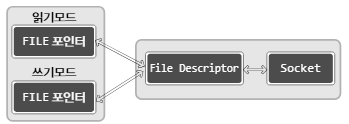
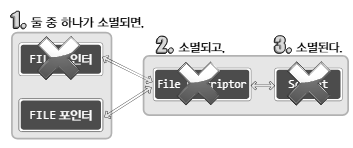
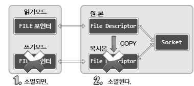

# CH 16. 입출력 스트림의 분리에 대한 나머지 이야기

## 16-1 입력 스트림과 출력 스트림의 분리

- 두 번의 입출력 스트림 분리

앞 CH에서 두 가지 방법의 입출력 스트림을 분리해 보았다. 첫 번째 분리는 fork 함수호출을 통해서, 두 번째 분리는 fdopen 함수호출을 통해서 분리했다.

---

- 스트림 분리의 이점

그러면 먼저 두 스트림의 이점을 각각 정리해보자.

fork 함수호출을 통한 스트림 분리목적은 다음과 같다.<br>
**·** 입력루틴(코드)과 출력루틴의 독립을 통한 구현의 편의성 증대<br>
**·** 입력에 상관없이 출력이 가능하게 함으로 인해서 속도의 향상 기대

fdopen 함수호출을 통한 스트림 분리목적은 다음과 같다.<br>
**·** FILE 포인터는 읽기모드와 쓰기모드를 구분해야 하므로, 읽기모드와 쓰기모드의 구분을 통한 구현의 편의성 증대<br>
**·** 입력버퍼와 출력버퍼를 구분함으로 인한 버퍼링 기능의 향상

- 스트림 분리 이후 EOF에 대한 문제점

그럼 이번에는 스트림 분리의 문제점에 대해서 하나 이야기하겠다. CH 07에서 EOF의 전달 방법과 Half-close의 필요성에 대해서 언급했다.
```cpp
shutdown(sock, SHUT_WR);
```
당시에 shutdown 함수호출을 통한, Half-close 기반의 EOF 전달방법에 대해 설명했다. fork 함수호출을 통한 스트림 분리에서는 문제가 없다. 하지만 fdopen 함수호출을 통한 스트림 분리에서는 문제가 생긴다. 이 상황에 대한 Half-close 방법을 알지 못 하기 때문이다.
> 출력모드의 FILE 포인터를 대상으로 fclose 함수를 호출하면 되는 것 아닌가? 그러면 EOF가 전달되면서 Half-close 상황이 연출될 것 같은데...

그럴싸한 예측이다. 하지만 다음 예제를 보자.<br>
[예제 링크 추가 해야 됨](./)<br>
예제 코드를 돌려보면 결과적으로 문제가 생긴다. 하나의 스트림에 대해 fclose 함수를 호출하면 해당 FILE 포인터가 완전종료가 되기 때문이다. 따라서 fdopen 함수호출로 만들어진 FILE 포인터를 대상으로 Half-close를 진행하는 법을 추가로 알아야 한다.

## 16-2 파일 디스크립터의 복사와 Half-close

<br>
<br>
위 그림을 보자. 예제 코드에서 보였던 상황을 시각화한 것이다. 두 FILE 포인터 모두 같은 파일 디스크립터를 가리키기 때문에, 어떠한 FILE 포인터를 대상으로 fclose 함수를 호출하더라도 파일 디스크립터가 종료되고, 이는 소켓의 완전종료로 이어진다.

그러면 어떻게 해야할까? 의외로 간단하게 해결이 가능하다. FILE 포인터를 생성하기에 앞서 파일 디스크립터를 복사하면 된다. 그리고 원본과 복사본에 각각 읽기모드와 쓰기모드를 담당하는 FILE 포인터를 할당해주면 된다. 이게 가능한 이유는 다음과 같다.
> 모든 파일 디스크립터가 소멸되어야 소켓도 소멸되기 때문이다.

즉, 파일 디스크립터를 복제하여 각각 FILE 포인터를 할당하면, 어떠한 포인터를 대상으로 fclose 함수를 호출해도 해당 FILE 포인터와 연관된 파일 디스크립터만 소멸될 뿐, 소켓은 소멸되지 않는다.<br>
<br>
위 그림과 같이 fclose 함수호출 후에도 아직 파일 디스크립터가 하나 더 남아있기 때문에 소켓은 소멸되지 않는다. 하지만 이 상태를 Half-close로 볼 수는 없다. 파일 디스크립터가 하나 남아있고, 파일 디스크립터는 입력 및 출력이 모두 가능하기 때문이다.

---

- 파일 디스크립터의 복사

우선 파일 디스크립터를 복사하는 방법을 알아보자. 기존의 fork 함수호출 시 진행되는 복사는 프로세스를 통째로 복사하는 상황에서 이뤄지기 때문에, 하나의 프로세슬에 원본과 복사본이 모두 존재하지 않는다. 그러나 여기서 말하는 복사는 프로세스의 생성을 동반하지 않는, 원본과 복사본이 하나의 프로세스 내에 본재하는 형태의 복사를 뜻한다.<br>
물론 파일 디스크립터의 값이 중복될 수 없으므로 두 파일 디스크립터의 값은 서로 다르다.

---

- dup & dup2

파일 디스크립터를 복사하기 위해서는 다음 두 함수 중 하나를 이용하면 된다.
```cpp
#include <unistd.h>

int dup(int fildes);
int dup(int fildes, int fildes2);
// 성공 시 복사된 파일 디스크립터, 실패 시 -1 반환
```

dup2 함수는 복사된 파일 디스크립터의 정수 값을 명시적으로 지정할 때 사용한다. 이 함수의 인자로, 0보다 크고 프로세스당 생성할 수 있는 파일 디스크립터의 수보다 작은 값을 전달하면, 해당 값을, 복사되는 파일 디스크립터의 정수 값으로 지정해 준다.

