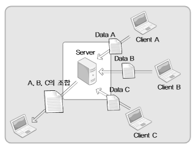

# CH 17. select보다 더 나은 epoll

## 17-1 epoll의 이해와 활용

select는 오래 전에 개발된 멀티플렉싱 기법이다. 때문에 이를 이용하면 아무리 프로그램의 성능을 최적화시킨다 해도, 허용할 수 있는 동시접속자의 수가 백을 넘기 힘들다. 이에 대한 대안으로 리눅스 영역에서 주로 활용되는 epoll에 대해 알아보자.

---

- select 기반의 IO 멀티플렉싱이 느린 이유

CH 12에서 select 기반의 멀티플렉싱 서버를 구현해 본 경험이 있기 때문에 코드상에서의 불합리한 점이 있다는 것을 알 수 있다. 가장 큰 두 가지는 다음과 같다.
1. select 함수호출 이후에 항상 등장하는, `모든 파일 디스크립터를 대상으로 하는 반복문`
2. select 함수를 호출할 때마다 인자로 `매번 전달해야 하는 관찰대상에 대한 정보들`

select 함수가 호출되고 나면, 상태변화가 발생한 파일 디스크립터만 따로 묶이는 것이 아니라, 관찰대상을 묶어서 인자로 전달한 fd_set형 변수의 변화를 통해서 상태변화가 발생한 파일 디스크립터를 구분하기 때문에, 모든 파일 디스크립터를 대상으로 하는 반복문의 삽입은 어쩔 수 없다. 뿐만 아니라, 관찰대상을 묶어놓은 fd_set형 변수에 변화가 생기기 때문에 select 함수의 호출이전에 원본을 복사해 두고 select 함수를 호출할 때마다 새롭게 관찰대상의 정보를 전달해야 한다.<br>
그럼 두 문제점 중에서 어느 것이 `더 큰 걸림돌`일까? 바로 `2번`이다. select 함수를 호출할 때마다 관찰대상에 대한 정보를 `매번 운영체제에게 전달해야 하기 때문`이다.
> 왜 운영체제에게 정보를 전달해야 할까?

함수 중에는 `운영체제의 도움 없이 기능을 완성하는 함수`가 있고, `운영체제의 도움이 절대적으로 필요한 함수`가 있다. `select 함수`는 파일 디스크립터(소켓의 변화)를 관찰하는 함수이기 때문에 `운영체제의 도움이 필요`하다. 따라서 select 함수의 단점은 다음과 같은 방식으로 해결해야 한다.
> 운영체제에게 관찰대상에 대한 정보를 딱 한 번만 알려주고서, 관찰대상의 범위, 또는 내용에 변경이 있을 때 변경 사항만 알려준다.

단, 이는 운영체제가 이러한 방식에 동의할 경우에 가능한 일이다. 때문에 운영체제 별로 지원여부도 다르고 지원방식에도 차이가 있다. `리눅스`에서 지원하는 방식을 가리켜 `epoll`이라 하고, `윈도우에`서는 `IOCP`라 한다.

---

- 그렇다면 select는 필요 없을 것일까?

위의 내용만 보면 개고생해서 배운 select 함수가 쓰레기로 보일 수 있다. 하지만 생각보다 쓸모있는 경우가 있다. 다음 두 가지 유형의 조건이 만족 또는 요구되는 상황이라면, 사용하는 것을 고려해볼 수 있다.<br>
· 서버의 `접속자 수가 많지 않다.`<br>
· `다양한 운영체제에서 운영이 가능`해야 한다.(`epoll은 리눅스`에서만 지원하지만 `select는 대부분의 운영체제`에서 지원을 한다.)

---

- epoll의 구현에 필요한 함수와 구조체

select 함수의 단점을 극복한 `epoll에는 다음의 장점`이 있다.<br>
· 상태변화의 확인을 위한, `전체 파일 디스크립터를 대상으로 하는 반복문이 필요없다.`<br>
· select 함수에 대응하는 epoll_wait 함수호출 시, `관찰대상의 정보를 매번 전달할 필요가 없다.`<br>

epoll 기반의 서버구현에 필요한 세 가지 함수는 다음과 같다.
| 함수 이름 | 기능 |
| :---: | --- |
| `epoll_create` | epoll 파일 디스크립터 저장소 생성 |
| `epoll_ctl` | 저장소에 파일 디스크립터 등록 및 삭제 |
| `epoll_wait` | select 함수와 마찬가지로 파일 디스크립터의 변화를 대기한다. |

`select 방식`에서는 select 함수호출 시 전달한 `fd_set`형 변수의 변화를 통해서 관찰대상의 상태변화를 확인하지만, `epoll` 방식에서는 다음 구조체 `epoll_event`를 기반으로 상태변화가 발생한 파일 디스크립터가 별도로 묶인다.

```cpp
struct epoll_event {
    __uint32_t events;
    epoll_data_t data;
}

typedef union epoll_data {
    void* ptr;
    int fd;
    __uint32_t u32;
    __uint64_t u64;
} epoll_data_t;
```

위의 구조체 epoll_event 기반의 배열을 넉넉한 길이로 선언해서 epoll_wait 함수호출 시 인자로 전달하면, `상태변화가 발생한 파일 디스크립터의 정보가 이 배열에 묶이기 때문`에 select 함수에서 보인, 전체 파일 디스크립터를 대상으로 하는 반복문은 불필요하다.

---

- epoll_create

함수 소개에 앞서 `epoll은 리눅스 커널 버전 2.5.44`에서부터 소개되었다. 현재 기준으로 대부분의 리눅스 커널은 대부분 해당 버전보다 높을 것이다. 혹시 불안하면 아래 명령어로 커널의 버전을 확인할 수 있다.
```sh
cat /proc/sys/kernel/osrelease
```

확인이 되었다면 epoll_create 함수를 알아보자.
```cpp
#include <sys/epoll.h>

int epoll_create(int size);
// 성공 시 epoll 파일 디스크립터, 실패 시 -1 반환
```
epoll_create 함수호출 시 생성되는 파일 디스크립터의 저장소를 가리켜 `epoll 인스턴스`라 한다. 그러나 변형되어서 다양하게 불리고 있으니, 약간의 주의가 필요하다. 매개변수 size는 epoll 인스턴스의 크기를 결정하는 정보로 사용된다. 하지만 이 값은 단지 운영체제에 전달하는 힌트이다. 즉, 인자로 전달된 크기의 epoll 인스턴스가 생기는 것이 아니라, 크기를 결정하는데 있어서 참고로만 사용된다.

---

- epoll_ctl

epoll 인스턴스 생성 후에는 이곳에 `관찰대상이 되는 파일 디스크립터을 등록`해야 하는데, 이때 사용하는 함수가 `epoll_ctl`이다.

```cpp
#include <sys/epoll.h>

int epoll_ctl(int epfd, int op, int fd, struct epoll_event* event);
// 성공 시 0, 실패 시 -1 반환
```

문장을 통해서 이해를 해보자.
```cpp
epoll_ctl(A, EPOLL_CTL_ADD, B, C);
```
여기서 두 번재 인자인 EPOLL_CTL_ADD는 추가를 의미한다. 따라서 다음과 같은 의미를 갖는다.
> epoll 인스턴스 A에, 파일 디스크립터 B를 등록하되, C를 통해 전달된 이벤트의 관찰을 목적으로 등록을 진행한다.

그럼 epoll_ctl의 두 번째 인자로 전달 가능한 상수는 어떤 것이 있는지, 그리고 그 의미를 정리해 보자.
| 상수 | 의미 |
| :---: | --- |
| `EPOLL_CTL_ADD` | 파일 디스크립터를 epoll 인스턴스에 등록한다. |
| `EPOLL_CTL_DEL` | 파일 디스크립터를 epoll 인스턴스에서 삭제한다. |
| `EPOLL_CTL_MOD` | 등록된 파일 디스크립터의 이벤트 발생상황을 변경한다. |

다음으로 epoll_event의 멤버인 events에 저장 가능한 상수와 이벤트의 유형에 대해 정리해 보자.
| 상수 | 의미 |
| :---: | --- |
| `EPOLLIN` | 수신할 데이터가 존재하는 상황 |
| `EPOLLOUT` | 출력버퍼가 비워져서 당장 데이터를 전송할 수 있는 상황 |
| `EPOLLPRI` | OOB 데이터가 수신된 상황 |
| `EPOLLRDHUP` | 연결이 종료되거나 Half-close가 진행된 상황, 이는 엣지 트리거 방식에서 유용하게 사용될 수 있다. |
| `EPOLLERR` | 에러가 발생한 상황 |
| `EPOLLET` | 이벤트의 감지를 엣지 트리거 방식으로 동작시킨다. |
| `EPOLLONESHOT` | 이벤트가 한 번 감지되면, 해당 파일 디스크립트에서는 더 이상 이벤트를 발생시키지 않는다. 따라서 epoll_ctl 함수의 두 번째 인자로 EPOLL_CTL_MOD를 전달해서 이벤트를 재설정해야 한다. |

위의 상수들은 `비트 OR 연산자`를 이용해서 `둘 이상을 함께 등록`할 수 있다.

---

- epoll_wait

이제 마지막으로 select 함수에 해당하는 `epoll_wait` 함수를 알아보자. 기본적으로 이 함수가 epoll 관련 함수 중에서 `가장 마지막에 호출`된다.
```cpp
#include <sys/epoll.h>

int epoll_wait(int epfd, struct epoll_event* event, int maxevents, int timeout);
// 성공 시 이벤트가 발생한 파일 디스크립터의 수, 실패 시 -1 반환
```

함수호출 후에는 `이벤트가 발생한 파일 디스크립터의 수가 반환`되고, 두 번째 인자로 전달된 주소 값의 `버퍼에는 이벤트가 발생한 파일 디스크립터의 정보가 별도로 묶이기 때문`에 select 방식에서 보인 전체 파일 디스크립터를 대상으로 하는 반복문의 삽입이 불필요하다.

---

## 17-2 레벨 트리거(Level Trigger)와 엣지 트리거(Edge Trigger)

epoll을 완전히 이해하기 위해서는 `레벨 트리거` 방식과 `엣지 트리거` 방식의 차이를 알아야 한다.

---

- 레벨 트리거와 엣지 트리거의 차이

우선 레벨 트리거의 이벤트 특성을 알아보자.
> 레벨 트리거 방식에서는 `입력버퍼에 데이터가 남아있는 동안 계속해서 이벤트가 등록`된다.

예를 들어서 서버의 입력버퍼로 50바이트의 데이터가 수신되면, 일단 서버 측 운영 체제는 이를 이벤트로 등록한다. 그런데 서버 프로그램에서 20바이트를 수신해서 입력버퍼에 30바이트만 남는다면, 이 상황 역시 이벤트로 등록이 된다. 결과적으로 버퍼가 비워질 때까지 이벤트가 발생한다.<br>
`엣지 트리거`는 레벨 트리거와 다르게 입력버퍼로 `데이터가 수신된 상황에서 딱 한 번만 이벤트가 등록`된다. 때문에 버퍼가 데이터가 남아있다고 해서 이벤트를 추가로 등록하지 않는다.

---

- 엣지 트리거 기반의 서버 구현을 위해서 알아야 할 두 가지

엣지 트리거 구현에 있어서 필요한 두 가지 내용은 다음과 같다.
· 변수 `errno`을 이용한 오류의 원인을 확인하는 방법
· `넌-블로킹(Non-blocking) IO`를 위한 소켓의 특성을 변경하는 방법

일반적으로 리눅스에서 제공하는 소켓관련 함수는 `-1`을 반환함으로써 오류의 발생을 알린다. 따라서 오류가 발생했음을 인식할 수는 있으나, 이것만으로는 `오류의 원인을 정확히 확인할 수 없다.` 때문에 리눅스에서는 오류발생 시 추가적인 정보의 제공을 위해서 다음의 변수를 전역으로 선언해 놓고 있다.
```cpp
int errno;
```
그리고 이 변수의 접근을 위해서는 헤더파일 `errno.h`를 포함해야 한다.

이번에는 `소켓을 넌-블로킹 모드로 변경`하는 방법을 알아보자. 리눅스에는 파일의 특성을 변경 및 참조하는 함수가 정의되어 있다.(CH 13에서 사용한바 있다.)
```cpp
#include <fcntl.h>

int fcntl(int filedes, int cmd, . . . );
// 성공 시 매개변수 cmd에 따른 값, 실패 시 -1 반환
```
위에서 보이듯이 fcntl 함수는 `가변인자의 형태로 정의`되어 있다. 그리고 두 번째 인자로 `F_GETEL`을 전달하면, `첫 번째 인자로 전달된 파일 디스크립터에 설정되어 있는 특성정보를 int형으로` 얻을 수 있으며, 반대로 `F_SETFL`을 인자로 전달해서 `특성정보를 변경`할 수도 있다.<br>
파일(소켓)을 넌-블로킹 모드로 변경하기 위해서는 다음의 두 문장을 실행하면 된다.
```cpp
int flag = fcntl(fd, F_GETFL, 0);
fcntl(fd, F_SETFL, flag | O_NONBLOCK);
```
첫 번째 문장을 통해서 기존에 설정되어 있던 `특성정보`를 얻어오고, 두 번째 문장에서는 여기에 `넌-블로킹 입출력`을 의미하는 `O_NONBLOCK`을 더해서 특성을 재설정해주고 있다.

---

- 레벨 트리거와 엣지 트리거 중에 뭐가 더 좋을까

엣지 트리거 방식을 사용하면 다음과 같은 형태의 구현이 가능하다.
> 데이터의 `수신`과 데이터가 `처리`되는 `시점을 분리`할 수 있다.

이는 단순하지만 엣지 트리거의 장점을 매우 정확하게 설명하고 있다. 한 가지 시나리오를 보며 이해해보자.<br>
<br>
위 그림에서 연출한 시나리오는 다음과 같다.<br>
· 서버는 클라이언트 A, B, C로부터 각각 데이터를 수신한다.<br>
· 서버는 수신한 데이터를 A, B, C의 순으로 조합한다.<br>
· 조합한 데이터는 임의의 호스트에게 전달한다.

위의 시나리오를 완성하기 위해서 다음과 같은 형태로만 흐름이 전개되면, 서버의 구현은 그리 어렵지 않다.<br>
· 클라이언트 A, B, C가 순서대로 접속해서 데이터를 순서대로 서버에 전송한다.<br>
· 데이터를 수신할 클라이언트는 클라이언트 A, B, C에 앞서 먼저 접속을 하고 대기한다.

그러나 현실적으로는 다음과 같은 상황이 빈번히 일어난다. 즉, 다음의 상황이 보다 현실적이다.<br>
· 클라이언트 C와 B는 서버로 데이터를 전송하고 있는데, A는 아직 연결조차 하지 않은 경우<br>
· 클라이언트 A, B, C가 순서에 상관없이 데이터를 서버에 전송하는 경우<br>
· 서버로 데이터가 전송되고 있는데, 정작 이 데이터를 수신할 클라이언트가 아직 연결되지 않은 경우

따라서 입력버퍼에 데이터가 수신된 상황임에도 불구하고 이를 읽어 들이고 `처리하는 시점을 서버가 결정`할 수 있도록 하는 것은 서버 구현에 엄청난 `유연성`을 제공한다. 다만, 엣지 트리거가 좋은 성능을 발휘할 확률이 상대적으로 높을 뿐이고, 단순히 엣지 트리거를 적용했다고 해서 무조건 빨리진다고 할 수는 없다.
