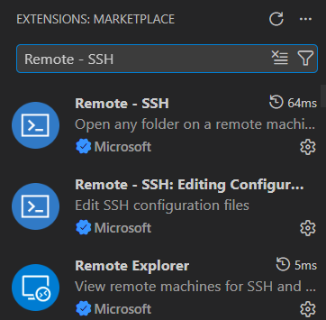
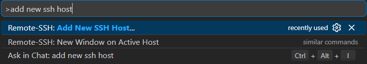
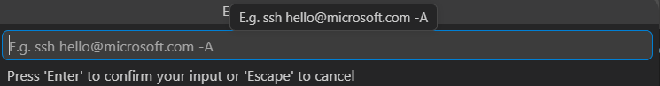
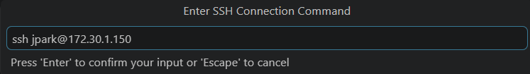
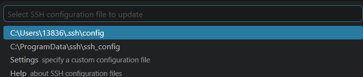
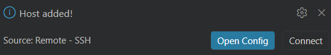
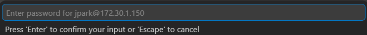

# Visual Studio Code SSH 접속 구성

Visual Studio Code와 VM 가상 머신을 SSH로 연결하여 Host에서 원격으로 코드 작업을 하는 방법 요약.

## 목차 

1. Visual Studio Code 설치
2. Visual Studio Code 확장 설치 및 개발 환경 구축
3. SSH로 원격 접속 연결

### 1. Visual Studio Code 설치

[다운로드 링크](https://code.visualstudio.com/)  
위의 링크로 들어가서 Visual Studio Code를 설치한다.

---

### 2. Visual Studio Code 확장 설치 및 개발 환경

**1.**

  
먼저 좌측 바에 있는 이 아이콘을 누르거나 `Ctrl + Shift + X` 키를 눌러 `EXTENSIONS` 창을 연다.
  

**2.**

상단 검색창에 `"Remote - SSH"`를 검색하면 아래와 같이 SSH 관련 확장들이 나타날 것이다.

여기서 상단에 있는 Remote-SSH 확장을 설치 후 프로그램을 재실행 한다.

**3.**

`Ctrl + Shift + p` 키를 눌러 상단 중앙의 터미널을 열고, `"Add New SSH Host"`라고 입력한다.

**4.**

커맨드 입력 창이 활성화 되면 `ssh [사용자 이름]@[접속할 PC의 IP 주소]`를 입력한다.

**5.**

SSH 연결 시 사용할 구성을 선택하라는 창이 나타나면 원하는 구성을 선택하면 된다. 보통은 최상단과 같이 기본 경로에 구성된 디폴트 구성을 사용하면 된다.

**6.**

가상 머신 추가가 완료되면 우측 하단에 해당 알림이 나타날 것이다. 여기서 Connect를 선택하면 SSH 연결을 할 수 있다.

**7.** 

연결할 때마다 상단 중앙 터미널에 가상 머신의 패스워드를 작성하면 된다. 또한 연결 내역은 좌측 바에 있는 Remote Explorer에서 확인할 수 있다.